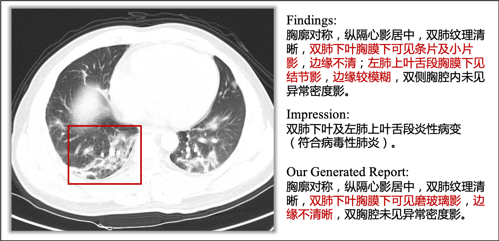
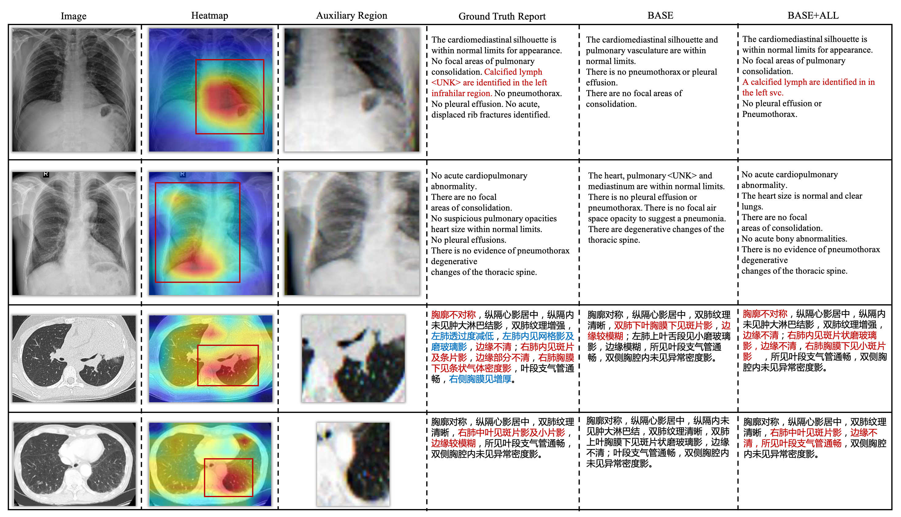
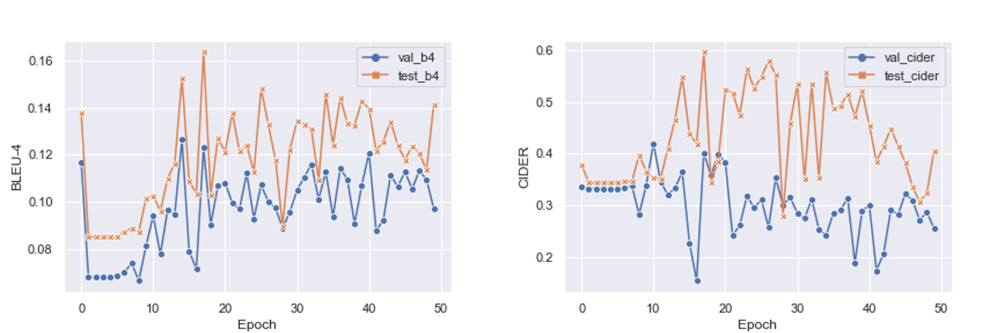

## News

Our work has been accpeted by the WWWJ2022. This is the official project page for our paper title "Auxiliary signal-guided knowledge encoder-decoder for medical report generation" along with both dataset and code.

## Welcome

Since December 2019, the novel COVID-19 virus has caused a global pandemic and infected millions of people across 200 countries. 
A key step in controlling the infection is that of identifying infected people. 
In addition to the Reverse Transcription Polymerase Chain Reaction (RT-PCR) tests, lung CT scan analysis has emerged as another essential testing method. 

[Monash Machine Vision Group](http://www.mmvg.org/) recently constructed a COVID-19 CT Reports (COV-CTR) dataset and proposed a new medical report generation approach via AI technologies to describe lung CT images.

### COV-CTR Dataset

We invited three radiologists come from **The First Affiliated Hospital of Harbin Medical University** with more than five years of working experience to apply their diagnostic skills to the public [COVID-CT Dataset](https://github.com/UCSD-AI4H/COVID-CT) and use this information to construct the COV-CTR dataset. 
The COV-CTR consists 728 images (349 for COVID-19 and 379 for Non-COVID) collected from published papers and their corresponding paired Chinese reports. 
More information about these images could be found on [COVID-CT Dataset](https://github.com/UCSD-AI4H/COVID-CT).

The **COV-CTR** including all images and paired Chinese reports is available online, 
[DownLoad Now](https://github.com/mlii0117/COV-CTR/tree/master/Datasets).

One sample in our COV-CTR dataset. Including the CT-scan,  findings,  impressions,  and  our  generated  report.   The  redwords describe the abnormal terminologies.  A radiologist anno-tated the red bounding box to indicate the region that he paid moreattention to diagnosing this image.

### Auxiliary Signals Driven Transformer For Medical Report Generation

Medical reports have significant clinical value to radiologists and specialists, especially during a pandemic like COVID.
However, beyond the common difficulties faced in natural image captioning tasks, small-sized datasets, limited annotations, and severe data deviation are remaining bottlenecks for the advancement of medical report generation approaches.
Inspired by the radiologists' working patterns, in this paper, we investigate two kinds of auxiliary signals to drive Transformer for medical report generation to address these problems.
Specifically, the auxiliary patches are explored to expand the widely used visual patch features before fed to the Transformer encoder, while the external linguistic signals help the decoder better master prior knowledge during the pre-training process.
Our approach performs well on common benchmarks, including CX-CHR, IU X-Ray, and COVID-19 CT Report dataset (COV-CTR), demonstrating combining auxiliary signals with transformer architecture can bring a significant improvement in terms of medical report generation.
The experimental results confirm that auxiliary signals driven Transformer-based models are with solid capabilities to outperform previous approaches on both medical terminology classification and paragraph generation metrics.

Sample outputs of our approach on IU X-Ray and COV-CTR. The red words represent the matched abnormal terminologies. The words in blue are missed abnormal terminologies.

We evaluate our model each epoch and report BLEU-4 and CIDER values on validation and testing sets.

Paper is available in [Arxiv](https://arxiv.org/abs/2006.03744).

If you are interested in this dataset and would like to jointly augment this dataset, please connect us: Mingjie.Li@monash.edu

If you use this dataset and code, please cite our work.

~~~
@article{li2020auxiliary,
  title={Auxiliary signal-guided knowledge encoder-decoder for medical report generation},
  author={Li, Mingjie and Wang, Fuyu and Chang, Xiaojun and Liang, Xiaodan},
  journal={arXiv preprint arXiv:2006.03744},
  year={2020}
}
~~~
